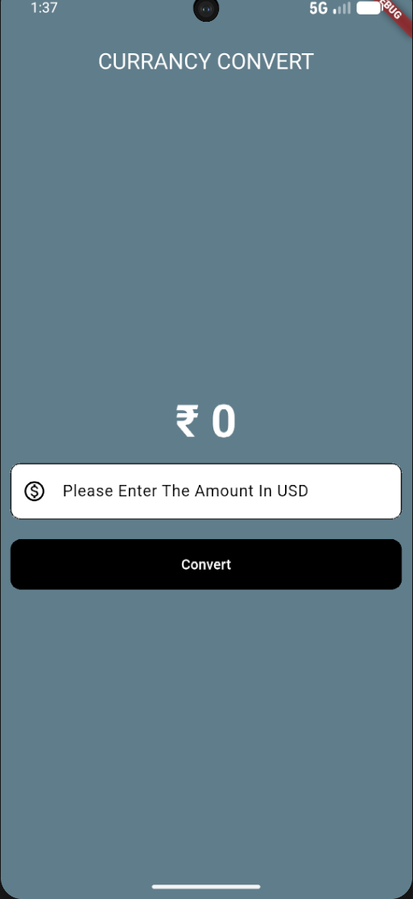

# Currency Converter

A simple and clean Currency Converter mobile application built using Flutter. This app allows users to convert currency values instantly with a smooth UI and responsive layout.

## Features

✅ Convert currency amounts easily

✅ Simple & clean UI

✅ Responsive for different screen sizes

✅ Fast conversion result display

✅ Built using Flutter Material Design

## Tech Stack

Flutter

Dart

Material UI

## Installation

Clone the repo

git clone https://github.com/k-saravanan-2006/CURRANCY_CONVERTER.git

Move into project folder

cd CURRANCY_CONVERTER

Install dependencies

flutter pub get

Run the app

flutter run

## Screenshots

## Developed By

K Saravanan